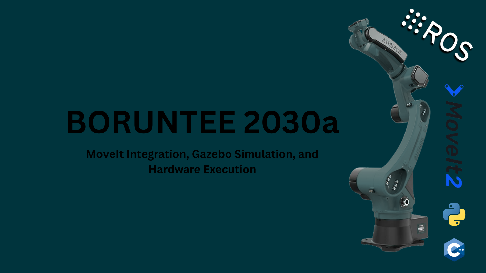

# Boruntee 2030 a {ROS2, MoveIt, Gazebo, Hardware integration}

---

---

## 1. Introduction

#### This project demonstrates how to simulate, control, and plan motions for the **Boruntee 2030a** robotic arm using **ROS 2 Humble**, **Gazebo**, and **MoveIt!**. You'll learn how to launch Boruntee in simulation, set up path planning pipelines, and experiment with hardware-like control.

---

## 2. What is the  Boruntee 2030a?

The **Boruntee 2030a** is an industrial welding, heavy weight lifting robot:

- **ROS-based robot arm control**  
- **MoveIt motion planning pipelines**  
- **Gazebo simulation with URDF & meshes**  
- **Trajectory execution and visualization in RViz**

Unlike mobile robots, robotic arms require **inverse kinematics (IK)**, **path planning**, and **gripper/tool integration**. This project provides a structured way to explore those concepts with the Boruntee model.

Think of this as your **training ground for industrial robotics**. Instead of dealing with expensive hardware, you get the same software architecture in a safe simulated environment.

---

## 🙏 Thank You!

Thank you for exploring this project. I hope this project empowers you to dive deeper into robotics, hands-on learning, and real-world system integration. Your interest and dedication to building robots is what drives innovation in this field.

If you have **any suggestions, feedback, or improvements**, feel free to open an issue or reach out to me directly. Collaboration and learning go hand in hand, and I'd love to hear from you!

---

## 👤 About the Author

**Muhammad Saad**  
🎓 Mechatronics and Control Engineering Student  
🏫 University of Engineering and Technology, Lahore  
📍 Lahore, Pakistan  
📧 Email: [msaadmceu@gmail.com](mailto:msaadmceu@gmail.com)
